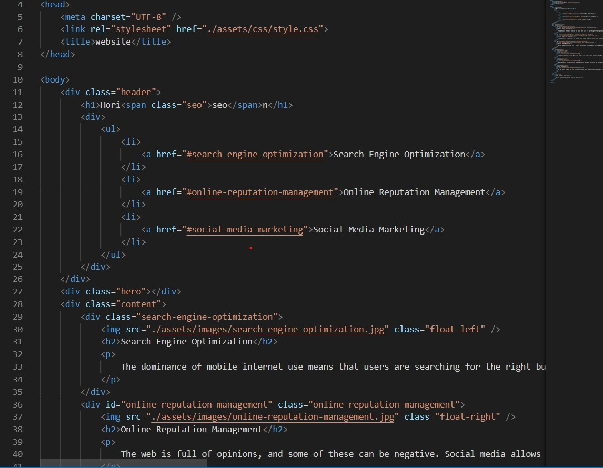

# Code Refractor
UWA web developement boot camp 2021

## Task:
go through the given html and css to build better semantics and or reform the scructor to read easier and to respond better

## what I managed to do:
first i was given a html and css file. 

 
so i went through looking for better semantics such as section tags,asides,articles and alt tags on all imgs

 

gave the nav its own section

 
put the main text into article tags

 
put the side bar into aside tags

 
also changed the footer h2 to h4 to organise better

 
There was also i missing id tag in the nav so i added a new id tag

## What i did to the css:
now the css was abit all over the place there were many double ups of code and elements and the code wasnt organised very well either 
so first i seperate the css into two seperate css files headerFooter and body (which included all links and imgs)
 
I then grouped up the headers in the headerFooter css file:

<b>
in the origonal there were many headers using the same atrributes that could have been grouped up:

after rearranging the code: 

 

I then found all img elements and grouped then up too under the same code block  
BEFORE:
 
AFTER:

I did the same with the aside images as you can see  
 
Anything i could see in the code that doubled up or didnt do anything i changed
 
This is my css after all its rearanging: 
##### HeaderFooter

##### BODY
